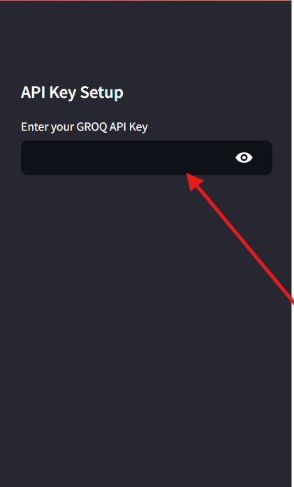
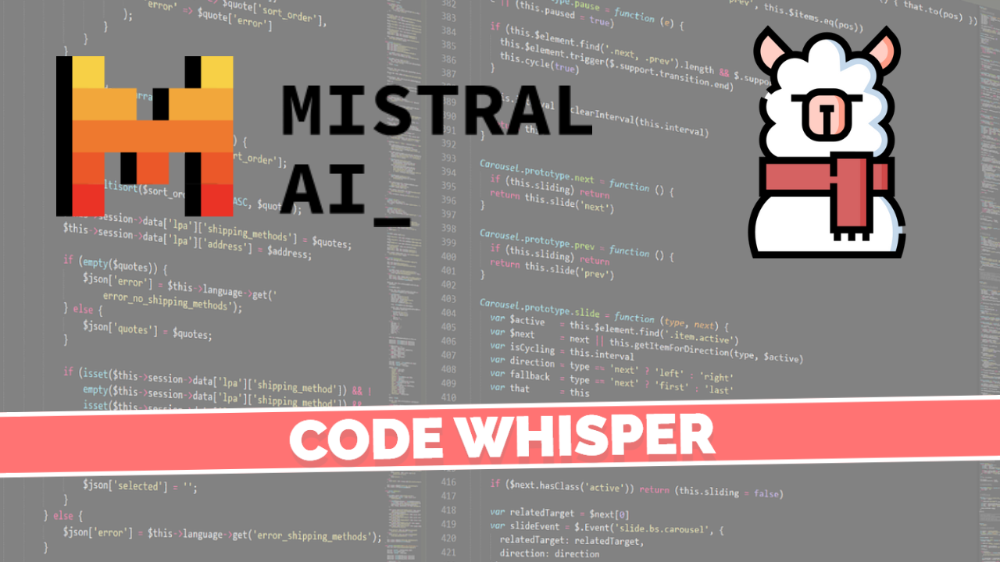

<div align="center">
    
</div>
<br><br>

<div align="center">
    
    
    
    
    
    
    
    
    
    
    
    
    
    
    
    
    
</div>
<br>

<div align='center' style=" display: grid;">

  [](mailto:ys3853428@gmail.com)
  [](https://github.com/yashksaini-coder)
  [](https://medium.com/@yashksaini)
  [](https://www.linkedin.com/in/yashksaini/)
  [](https://bento.me/yashksaini)
[](https://www.instagram.com/yashksaini.codes/)
  [](https://twitter.com/EasycodesDev) 
</div>

---

# 🚀 AI Coding Assistant

AI Coding Assistant is a powerful tool designed to assist developers by providing intelligent code suggestions, 🐞 debugging tips, and 📚 documentation generation. It leverages advanced large language models to enhance productivity and streamline the coding process.

## Features
- **Intelligent Code Suggestions**: Get smart code suggestions based on the context of your project. 💡
- **Mutliple Models Support**: Supports multiple LLM (large language models) to provide accurate suggestions. 🤖
- **Debugging Tips**: Receive helpful debugging tips to resolve errors efficiently. 🐛
- **Multi-language Support**: Supports various programming languages. 🌐

## Usage

To clone the repository and run the Python file, follow these steps:

1. **Clone the Repository:** Open your terminal and navigate to the directory where you want to clone the repository. Use the following command to clone the repository to your local machine:

    ```bash
    git clone https://github.com/yashksaini-coder/AI-Coding-Assistant
    ```

2. **Navigate to the Project Directory:** Use the following command to navigate to the project directory:

    ```bash
    cd AI-Coding-Assistant
    ```

3. **Install Dependencies:** If the project has any dependencies, use the following command to install them:

    ```bash
    pip install -r requirements.txt
    ```

4. **Run the Python File:** Use the following command to run the Python file:

    ```bash
    streamlit run app.py
    ```

5. **Interact with the AI Coding Assistant:** Once the Python file is running, you can interact with the AI Coding Assistant to get code suggestions, debugging tips, and documentation generation. But first you need to add your Groq API-KEY in the sidebar panel.

<div align="center">
  
</div>


## Demo Video: 

<div align="center">
    <a href="https://youtu.be/lEKjmKORdtM">
    
    </a>
</div>
