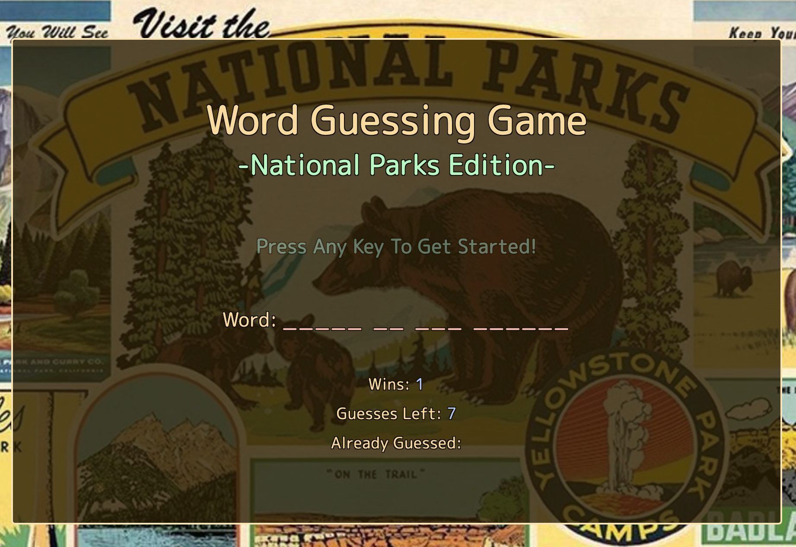

# Word Guess Game
 The Word Guess Game is a fun and interactive browser-based game that challenges players to guess a hidden word within a limited number of attempts. Built using JavaScript for functionality, CSS for styling, and HTML for structure, this game provides an engaging experience.

### Requirements

* App must suit these basic specs:
  * Choose a theme for your game! In the demo, we picked an 80s theme: 80s questions, 80s sound and an 80s aesthetic. You can choose any subject for your theme, though, so be creative!
  * Use key events to listen for the letters that your players will type.
  * Display the following on the page:
    * Press any key to get started!
    * Wins: (# of times user guessed the word correctly).
    * If the word is `madonna`, display it like this when the game starts: `_ _ _ _ _ _ _`.
    * As the user guesses the correct letters, reveal them: `m a d o _  _ a`.
    * Number of Guesses Remaining: (# of guesses remaining for the user).
    * Letters Already Guessed: (Letters the user has guessed, displayed like `L Z Y H`).
  * After the user wins/loses the game should automatically choose another word and make the user play it.

### Additional Features

* None of the guessing words will be repeated during a game.
* To add diffuculty, the number of guesses changes based on word length.
* Plays different sounds at the end of the game - one to congratulate a winner, one to taunt a loser and an easter egg of sorts if a player can manage to guess every single word in the game.

### Technologies Used
- [JavaScript](https://www.javascript.com/)
- [Bootstrap](https://getbootstrap.com/docs/4.0/getting-started/introduction/)

### Screen Shot
