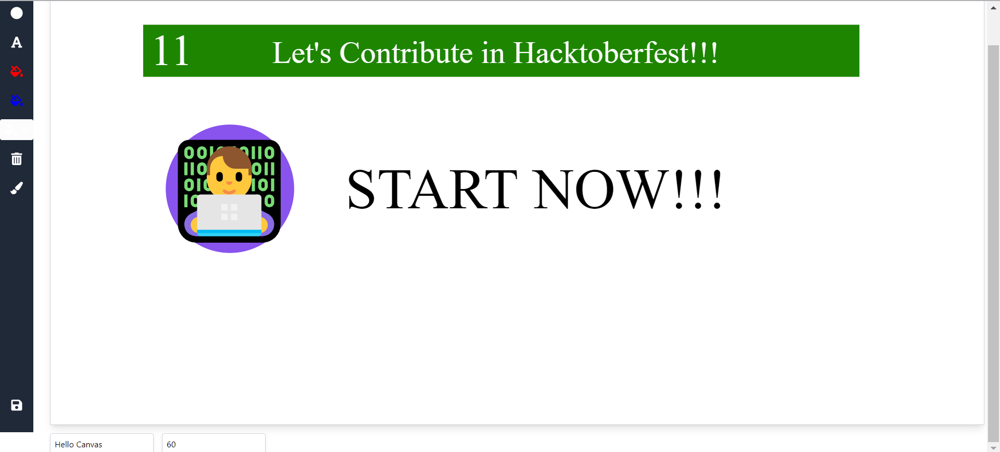

Here's a cool and visually appealing README template for your Fabric.js Canvas project. You can modify it according to your preferences and add any additional sections as needed:

---

# 🎨 GUI-2-HTML

Welcome to **GUI-2-HTML**! This is a fun and interactive web application built with React and Fabric.js, allowing users to create, edit, and export custom graphics easily. Whether you're a designer, educator, or just someone who loves to play with visuals, this tool is for you!

## ✨ Features

- **Draw and Create**: Add rectangles, circles, and text to your canvas with just a click.
- **Color Palette**: Change the color of your shapes and text dynamically.
- **Text Editing**: Easily modify the text and font size for your creations.
- **Drawing Mode**: Toggle between drawing on the canvas and manipulating objects.
- **Export HTML & CSS**: Generate and download the HTML and CSS code for your design.
- **Responsive Design**: Canvas adjusts to fit your screen size.

## 🚀 Getting Started

### Prerequisites

Make sure you have [Node.js](https://nodejs.org/) and [npm](https://www.npmjs.com/) installed on your machine.

### Installation

1. Clone the repository:
   ```bash
   git clone https://github.com/Luson045/web-dev-projects-hacktoberfest24
   ```
   
2. Navigate to the project directory:
   ```bash
   cd gui-2-html
   ```

3. Install the dependencies:
   ```bash
   npm install
   ```

4. Start the development server:
   ```bash
   npm start
   ```

5. Open your browser and visit [http://localhost:3000](http://localhost:3000) to see the application in action!

## 🖼️ How to Use

1. **Add Shapes**: Use the toolbar on the left to add rectangles and circles.
2. **Add Text**: Click the text button, type your text, and customize it.
3. **Change Colors**: Select an object and click on the color buttons to change its color.
4. **Draw Freely**: Toggle the drawing mode to draw on the canvas.
5. **Export Your Work**: Click the save button to download your design as an HTML file.

## 🎨 Demo

  
*Demo of Canvas Creator in action!*

## 🛠️ Technologies Used

- [React](https://reactjs.org/) - JavaScript library for building user interfaces.
- [Fabric.js](http://fabricjs.com/) - A powerful and simple JavaScript canvas library.
- [React Icons](https://react-icons.github.io/react-icons/) - Icon library for easy integration.

## 🤝 Contributing

Contributions are welcome! Feel free to submit a pull request or open an issue to discuss any improvements or features you would like to see.

## 📄 License

This project is licensed under the MIT License. See the [LICENSE](LICENSE) file for more information.

---

Feel free to customize sections like the demo image, repository link, and any additional features or details specific to your project!