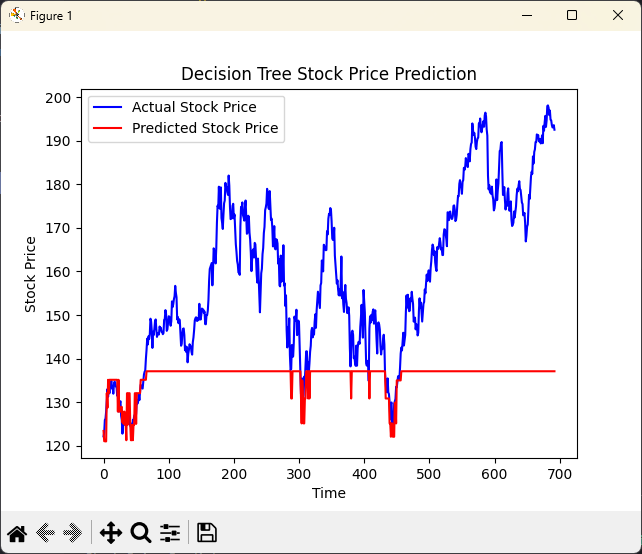
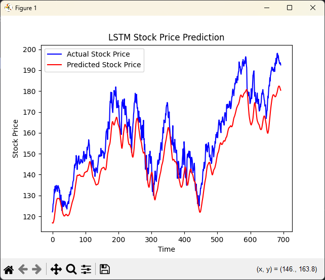

# 📈 Stock Price Predictor

Stock Price Predictor is a machine learning project that leverages historical stock market data to predict future stock prices using LSTM (Long Short-Term Memory) neural networks. This project uses data from Yahoo Finance and implements a time-series forecasting model to help predict trends in stock prices.

---

## 🌟 Features

- **Time Series Forecasting** using LSTM model
- Historical stock data retrieval from **Yahoo Finance**
- Data visualization for better understanding of trends
- Highly customizable for other stock tickers and time periods
- A beginner-friendly introduction to machine learning with stock data

---

## 🚀 Getting Started

### 1. Clone the Repository

```bash
git clone https://github.com/KoustavDeveloper/stock-price-predictor.git
cd stock-price-predictor
```

### 2. Create a Virtual Environment (Optional but Recommended)

```bash
python -m venv venv
source venv/bin/activate  # For Linux/MacOS
venv\Scripts\activate  # For Windows
```

### 3. Install Dependencies

Install the required Python libraries using the `requirements.txt` file:

```bash
pip install -r requirements.txt
```

### 4. Download Stock Data

You can download the historical stock data directly from Yahoo Finance using the following script. Replace the stock ticker and date range as per your preference.

```bash
python data/download_stock_data.py
```

This will download the stock data for **Apple Inc. (AAPL)** by default and save it as `data/stock_data.csv`.

### 5. Run the Stock Price Predictor

```bash
python main.py
```

This will train the LSTM model using the stock data and output the predictions.

---

## 📁 Project Structure

```plaintext
stock-price-predictor/
├── data/
│   ├── stock_data.csv           # Historical stock data
│   ├── download_stock_data.py   # Script to fetch stock data
├── models/                      # Folder to save trained models
├── lstm_predictor.py             # LSTM model implementation
├── main.py                       # Main script to run the prediction
├── requirements.txt              # Python dependencies
├── README.md                     # Project documentation
└── .gitignore                    # Git ignore file
```

---

## 📊 Visualizations

The project also includes visualizations to help you understand the stock trends better. For example, after training, the stock price trend and predictions are plotted on a graph.

### Example of Stock Price Prediction:




---

## 🧠 Concepts Used

This project utilizes the following machine learning and data science concepts:

- **LSTM Networks**: A type of recurrent neural network (RNN) that excels at learning and forecasting from time series data.
- **Time Series Forecasting**: Using historical data to predict future values.
- **Data Preprocessing**: Cleaning and normalizing the dataset to feed it into the model.
- **Data Visualization**: Plotting stock price data and predictions.

---

## 🛠️ Technologies Used

- **Python**: Main programming language
- **Pandas**: Data manipulation and analysis
- **Keras**: Deep learning library (with TensorFlow backend)
- **Scikit-learn**: Machine learning tools
- **Matplotlib**: For data visualization
- **Yahoo Finance**: For stock data retrieval

---

## 📝 Future Enhancements

- Expand the model to predict multiple stock prices simultaneously.
- Implement additional machine learning models such as **Random Forest** and **ARIMA** for comparison.
- Enhance the user interface with a **Flask** or **Streamlit** web app to make predictions interactive.

---

## 👩‍💻 Contributing

Contributions are welcome! Here's how you can get involved:

1. Fork the project
2. Create your feature branch: `git checkout -b feature/YourFeature`
3. Commit your changes: `git commit -m 'Add some feature'`
4. Push to the branch: `git push origin feature/YourFeature`
5. Open a pull request

---

## 🧑‍💻 Authors

- **Koustav Singh** – [KoustavDeveloper](https://github.com/KoustavDeveloper)

---

## 📜 License

This project is licensed under the MIT License - see the [LICENSE](LICENSE) file for details.

---

## 📞 Contact

For any issues or inquiries, feel free to contact me at:

- GitHub: [KoustavDeveloper](https://github.com/KoustavDeveloper)
- Email: [koustavsinghcollege@gmail.com](mailto:koustavsinghcollege@gmail.com)

---

## 🌟 Acknowledgments

- **Yahoo Finance** for providing the data API.
- Inspiration from various machine learning stock prediction projects.

---
