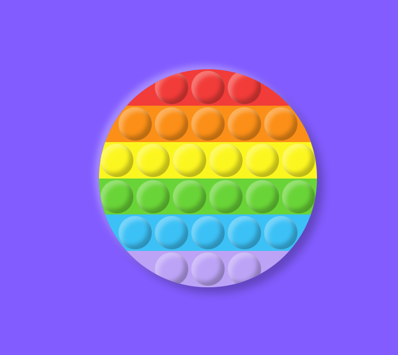

# 🫧 Virtual Pop-it Fidget Toy

A satisfying, interactive web-based fidget toy that simulates the popular pop-it/bubble pop fidget toys. Complete with realistic popping sounds and haptic feedback on supported devices!



## ✨ Features

- Rainbow-colored bubbles arranged in a circular pattern
- Satisfying pop sound effects
- Haptic feedback on mobile devices
- Smooth animations and realistic bubble depression
- Responsive design that works on both desktop and mobile
- Neumorphic design style for a modern, tactile feel

## 🛠️ Technical Details

The project is built using vanilla HTML, CSS, and JavaScript, featuring:

- Neumorphic shadows for a 3D button effect
- CSS transitions for smooth animations
- Audio feedback using the Web Audio API
- Vibration API for haptic feedback on mobile devices
- Responsive design using viewport units and max-width/height

## 📦 Installation

1. Clone the repository:
```bash
git clone https://github.com/KoustavDeveloper/virtual-popit.git
```

2. Open `index.html` in your web browser

Or simply host the files on any web server.

## 🗂️ Project Structure

```
virtual-popit/
├── index.html      # Main HTML structure
├── styles.css      # Styling and animations
├── script.js       # Interaction logic
└── pop_sound.mp3   # Pop sound effect
```

## 🎯 Usage

- Click or tap any bubble to pop it
- Click again to un-pop
- Works great as a stress reliever or focus tool
- Enjoy the satisfying pop sound and feel

## 🌈 Customization

You can easily customize the colors by modifying the CSS variables in `styles.css`:

```css
.r { background-color: #f23c39; }  /* Red */
.o { background-color: #fb8f17; }  /* Orange */
.y { background-color: #fcf620; }  /* Yellow */
.g { background-color: #69d437; }  /* Green */
.b { background-color: #3cc1f6; }  /* Blue */
.p { background-color: #bca3f6; }  /* Purple */
```

## 📱 Browser Support

- Works on all modern browsers
- Mobile-friendly
- Haptic feedback requires a device that supports the Vibration API

## 🤝 Contributing

Feel free to open issues and pull requests for any improvements you want to add!

## 📄 License

This project is open source and available under the [MIT License](LICENSE).

